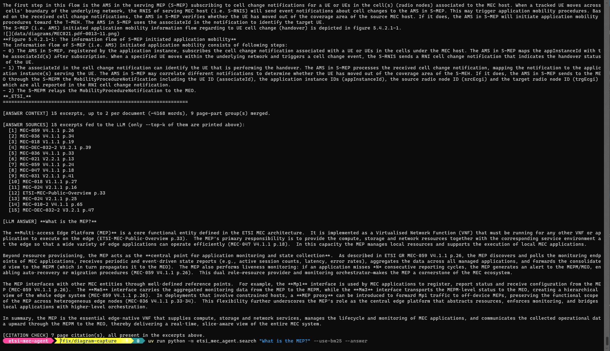
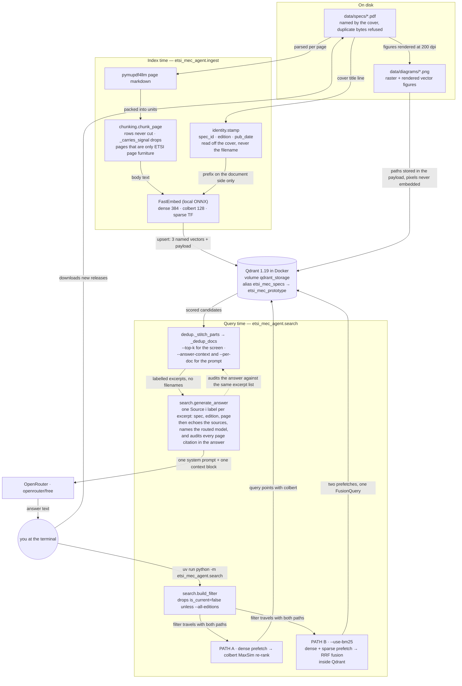

# etsi-mec-agent

An intelligent indexing and RAG agent for ETSI MEC (Multi-access Edge Computing) specifications using **FastEmbed** (local ONNX embeddings), **Qdrant** in Docker, and hybrid retrieval — a `dense` + `sparse` prefetch pair fused by RRF **inside Qdrant**, plus a separate `dense` → `colbert` MaxSim re-rank path — with optional LLM answers via OpenRouter.



*The run above is `uv run python -m etsi_mec_agent.search "What is the MEP?" --use-bm25 --answer`.*

Haystack is deliberately not used: the collection is created and queried through the
plain `qdrant_client`, and `QdrantDocumentStore` rejects a collection it did not create.

---

## Architecture Overview

The diagram below answers one onboarding question: **how does a PDF on disk become an answer on
screen, and which module owns each step?** Everything in it is code-backed — the node labels are the
functions that actually run. How each step is shaped is in the sections after it; the tables under
"What each script does" are the drill-down for the maintenance paths (identity stamping, cleanup,
eval) that deliberately are not drawn here.



---

## How the Three Vectors Work Together

All three vectors encode **text only**. Diagrams are rendered to PNG files and referenced
by path in the payload — no image is embedded as a vector.

```
Query: "Explain the role of Mp1 in MEC"
             │
     ┌───────┴────────────────────┐
     │ PATH A (default)           │ PATH B (--use-bm25)
     ▼                            ▼
┌──────────────────┐   ┌──────────────────────────────┐
│ dense 384-dim    │   │ dense  → prefetch 100        │
│ ↓ prefetch 25/45 │   │ sparse → prefetch 100        │
│ colbert MaxSim   │   │  (crc32 token → raw TF,      │
│   re-score per   │   │   IDF weighted server-side)  │
│   query token    │   │  ↓ RRF fusion inside Qdrant  │
└────────┬─────────┘   └──────────────┬───────────────┘
         ▼                             ▼
    fetch_k chunks          fetch_k×6 candidates (30 without --answer,
                                                    90 with it, --top-k 5)
        fetch_k = max(--top-k, --answer-context) — 5 or 15 by default
        PATH A re-scores max(--prefetch, 3×fetch_k) dense candidates and keeps fetch_k,
        PATH B hands stitching fetch_k×6 candidates — only those can merge.
                                    │
                                    ▼   (PATH A takes the same two steps)
                    _stitch_parts(): contiguous parts of one page —
                    "chunk_part 1 of 2" + "2 of 2" come back as one excerpt
                                    │
                                    ▼
             _dedup_docs() twice over that stitched list: text fingerprint,
             then keep=--top-k (one excerpt per content_md5) for the terminal
             print, and with --answer keep=--answer-context,
             per_doc=--per-doc for the prompt
```

| | `dense` | `colbert` | `sparse` | diagrams |
|--|---------|-----------|---------|---------|
| **What it encodes** | Whole chunk text | Token-by-token text | Term frequencies per chunk | Not encoded (metadata only) |
| **Vectors per chunk** | 1 × 384-dim | N × 128-dim (one per token) | 1 sparse vector | 0 |
| **Role in search** | Candidate retrieval (PATH A and B) | Precision re-ranking (PATH A) | Exact identifiers: `Mm3`, `Mp1`, clause numbers | Payload filter / display |
| **Scoring** | Cosine | Dot product (MaxSim) | Dot with corpus-wide IDF (`Modifier.IDF`) | N/A |
| **Speed** | Very fast | Slower (MaxSim) | Very fast | N/A |

> **Why three vectors?**
> `dense` is fast but works at the chunk level ("roughly about this topic").
> `colbert` re-ranks at the token level ("do the specific words match in context?").
> `sparse` handles what neither embedding reliably does: rare ETSI identifiers and
> clause numbers, where a single exact token is the whole signal. IDF is applied by
> Qdrant over the full corpus, so a token that appears in 3 of the 5,264 chunks currently indexed is weighted
> as rare instead of being scored inside whichever candidate set happened to be fetched.

---

## Components

- **Document Parser**: **PyMuPDF4LLM** extracts layout-aware Markdown, tables, and embedded raster images.
- **Diagram Capture**: `render_vector_figures()` renders the vector drawings ETSI specs actually use (box-and-arrow figures are not embedded rasters) at 200 dpi and merges adjacent raster tiles into a single whole figure; `_image_is_worth_keeping()` drops blank, sub-200px, and duplicate images.
- **Chunking**: `chunking.chunk_page()` packs whole units — a markdown table row, a paragraph, a heading — so a row is never cut mid-cell and every table chunk carries its clause and header row. Prose over the limit still uses the 300-word window with 40-word overlap, and sizes are held by a token estimate (pipes and `<br>` count), not just a word count, because ColBERT caps a passage at 512 tokens. A clause change only starts a new
  chunk once the chunk holds `min_words=150`, which is what stopped dense sub-clause tables shattering into
  one-row confetti (measured corpus-wide: 9,854 → ~4,800 chunks, p90 parts-per-page 46 → 2).
  `_carries_signal()` refuses a page whose text is nothing but ETSI's furniture — running title, `_ETSI_`
  footer, bare page number — while an image reference still counts, so figure-only pages survive
  `--diagrams-only`.
- **Identity and context on the document side**: `identity.stamp()` reads the ETSI title line off the PDF cover and every chunk carries `spec_id` / `edition` / `pub_date` / `content_md5` / `is_current`; what gets embedded is `spec_id edition clause heading + body` while what is stored and shown stays the page markdown. Query text is not expanded — asymmetric on purpose.
- **Embedding Engine**: [FastEmbed](https://github.com/qdrant/fastembed) runs locally via ONNX Runtime (zero API costs, runs on CPU).
- **Vector Database**: [Qdrant](https://qdrant.tech/) running via official Docker container.
- **PDF Monitor**: `tools/monitor_deliver.py` polls Exa for new ETSI PDF releases and downloads them automatically.
- **Exa Search**: `tools/exa_search.py` calls the Exa API directly (no third-party SDK) to locate official ETSI deliver PDFs.
- **Rank Shaping**: `src/etsi_mec_agent/dedup.py` — `_stitch_parts()` merges contiguous parts of one page, `_dedup_docs()` applies the text fingerprint and the per-document cap. Stdlib-only, so `scripts/check_dedup_stitch.py` asserts on it without loading the ONNX embedders.
- **Retrieval Eval**: `scripts/eval_rag.py` scores recall@k for both retrieval paths against golden questions, with a corpus evidence pre-check, and reports the rank inside the wider `--answer` evidence budget as an `aggregate` column.
- **Corpus Audit**: `scripts/audit_specs.py` hashes `data/specs/*.pdf`, reads each PDF's own title page, and reports manifest keys that do not name the document they point at, URLs it cannot verify, and spec numbers never fetched.
- **Schema Migration**: `scripts/migrate_add_sparse.py` adds a named vector to an existing collection by copying points, because Qdrant 1.19 cannot add named vectors in place.
- **LLM Answers**: OpenRouter's OpenAI-compatible endpoint, model ID `openrouter/free`, reasoning chain
  optional. `--answer` echoes the excerpt labels it sent (`[ANSWER SOURCES]`), names the model that
  actually served (`[ANSWER MODEL]`), then audits the answer's own page citations against that list
  (`[CITATION CHECK]`) — see "How an answer is assembled".
- **Package Manager**: [uv](https://github.com/astral-sh/uv) on Python 3.12.

---

## What each script does

### Pipeline modules (`src/etsi_mec_agent/`)

| Module | Owns | Loads a model? |
|---|---|---|
| `config.py` | The frozen `Settings` dataclass — every environment variable is read here | no |
| `store.py` | Qdrant client + `ensure_collection()`: the three named vectors and their payload indexes | no |
| `chunking.py` | `chunk_page()` row/clause packing, `_carries_signal()` furniture filter. Stdlib-only on purpose | no |
| `identity.py` | `cover_identity()`/`stamp()` (title line off the PDF), `safe_spec_filename()`, `keep_if_new()` md5 gate | no (pymupdf only) |
| `dedup.py` | `_stitch()`, `_stitch_parts()`, `_dedup_docs()` rank shaping. Stdlib-only on purpose | no |
| `ingest.py` | CLI: PDF → markdown → chunks → three vectors → upsert, with diagram extraction | yes |
| `search.py` | CLI: both retrieval paths, the display/evidence budgets, `generate_answer()` and its citation audit | yes |
| `agent.py` | Monitor entrypoint (`--watch-deliver`) | no |
| `tools/` | `monitor_deliver.py` + `spec_sync.py` (both download through `keep_if_new`), `etsi_forge.py`, `exa_search.py`, `clip_embed.py`, `local_search.py` | varies |

### Maintenance scripts (`scripts/`)

| Script | What it does | Writes to |
|---|---|---|
| `eval_rag.py` | recall@k for both retrieval paths over the golden questions, plus the `aggregate` column shaped like the `--answer` budget | Qdrant reads |
| `backfill_spec_identity.py` | `report` / `--apply` / `--verify`: stamps `spec_id`, `edition`, `pub_date`, `content_md5`, `is_current` from the covers — no re-embedding | Qdrant payloads |
| `drop_no_signal_chunks.py` | deletes the chunks the old chunker wrote from ETSI page furniture alone (dry run by default, `--apply` deletes, re-scans to prove it) | Qdrant deletes |
| `deduplicate_collection.py` | removes duplicate chunks in place by text fingerprint, electing one survivor per group | Qdrant deletes |
| `dedupe_spec_pdfs.py` | drops byte-identical PDFs from `data/specs`, keeping whichever copy the index's `filename` points at | files (`--apply`) |
| `audit_specs.py` | reports files or manifest keys that name a different spec than their content, unverifiable URLs, spec numbers never fetched | nothing |
| `migrate_add_sparse.py` | copies every point into a new collection whose schema has `sparse` — Qdrant 1.19 cannot add a named vector in place | Qdrant |
| `backfill_clip.py` | adds `clip` image vectors to existing points without re-ingesting | Qdrant |
| `graph_visualize.py` | force-directed spec-similarity graph → `etsi_mec_graph.png` | PNG |

### The checks, and why they matter here

There is no pytest suite. Each `check_*.py` is a runnable assertion file that **imports the production
symbols with `fastembed` stubbed in `sys.modules`**, so it verifies the shipped code path without loading
a 1 GB ONNX model on a 16 GB host — the only way retrieval and chunking changes can be tested on this
machine at all.

| Check | What it pins | Touches Qdrant? |
|---|---|---|
| `check_chunking.py` | rows never cut, headers repeated, clause floor, token bound, furniture-only pages yield nothing | no |
| `check_dedup_stitch.py` | overlap trim, page-part merge rules, `content_md5` per-doc quota, degenerate budgets | no |
| `check_download_naming.py` | cover-derived filenames, md5 refusal of duplicate bytes, dedupe keeper choice | no |
| `check_answer_grounding.py` | excerpt labels carry no filename, the citation audit's four verdicts, and `generate_answer`'s own wiring with `openai` faked | no |
| `check_diagram_filter.py` | the blank / sub-200px / duplicate-MD5 image filter keeps what it should | no |
| `check_eval_golden.py` | every golden question is answerable from a spec actually present in the collection, and `docs` is treated as a set | read-only |

---

## Getting Started

### 1. Prerequisites
- [uv](https://docs.astral.sh/uv/) installed.
- [Docker](https://www.docker.com/) running Qdrant.
- An [Exa API key](https://exa.ai) for the PDF monitor.

### 2. Start Qdrant in Docker
```bash
docker run -d -p 6333:6333 -p 6334:6334 \
    -v qdrant_storage:/qdrant/storage:z \
    --name qdrant \
    qdrant/qdrant
```
Verify Qdrant is accessible at `http://localhost:6333/dashboard`.

The live data is in the named volume `qdrant_storage`. `QDRANT_INDEX` names an **alias**, not a
collection, and two collections share that server:

| Alias | Points at | What it is |
|---|---|---|
| `etsi_mec_specs` (default) | `etsi_mec_prototype` | production: row/clause chunks, identity-stamped |
| `etsi_mec_specs_old` | `etsi_mec_specs_v2` | the word-window chunks, kept as the rollback |

There is **no `--index` flag**: everything reads `config.py::Settings.qdrant_index`, so target another
collection by exporting the variable in the same shell — `$env:QDRANT_INDEX="etsi_mec_prototype"` — for
ingest, backfill and eval together.

### 3. Add ETSI MEC PDFs
Drop ETSI MEC PDFs into `data/specs/`. The filename is a storage detail only — every chunk is labelled
from the PDF's own title line (`MEC-003 V4.1.1 (2025-05)`), so what you drop in is identified by what it
says on its cover, not by what you called the file.

```bash
uv run python scripts/audit_specs.py        # files or manifest keys that name the wrong spec
uv run python scripts/dedupe_spec_pdfs.py   # byte-identical copies, dry run first (--apply to delete)
```

### 4. Run PDF Ingestion
```bash
uv run python -m etsi_mec_agent.ingest
```

Options:
- To ingest a specific PDF or directory:
  ```bash
  uv run python -m etsi_mec_agent.ingest path/to/my_spec.pdf
  ```
- To wipe and recreate the Qdrant index before ingestion:
  ```bash
  uv run python -m etsi_mec_agent.ingest --recreate-index
  ```
- To skip PDFs whose `doc_id` is already indexed (safe incremental updates):
  ```bash
  uv run python -m etsi_mec_agent.ingest --skip-existing
  ```
- To preview a run without writing anything (no embeddings, no upserts; honors `--skip-existing` and previews `--recreate-index` wipes):
  ```bash
  uv run python -m etsi_mec_agent.ingest --dry-run --skip-existing
  ```
- To see what the chunker would emit for one PDF, and to skip figure extraction while iterating:
  ```bash
  uv run python -m etsi_mec_agent.ingest data/specs/MEC003.pdf --dry-run --no-diagrams --show-chunks 3
  ```

**After any ingest, run the identity pass.** `identity.stamp()` sets `is_current=True` for everything it
writes — which edition of a spec number is newest is only knowable once the whole corpus is in, so the
decision is a post-ingest step, not an ingest one:

```bash
uv run python scripts/backfill_spec_identity.py           # report only
uv run python scripts/backfill_spec_identity.py --apply   # stamp spec_id/edition/is_current/content_md5
uv run python scripts/backfill_spec_identity.py --verify  # prove search honours it, no ONNX loaded
```

### 5. Query / Search Specifications
```bash
uv run python -m etsi_mec_agent.search "What is the Mp1 reference point?"
```

| Flag | Effect |
|---|---|
| `--use-bm25` | PATH B: dense + sparse prefetch fused inside Qdrant by RRF (the recommended path) |
| `--answer` | hand the evidence budget to OpenRouter and print the answer |
| `--stream` | stream the answer token by token (no reasoning chain available) |
| `--show-reasoning` | print the model's thinking chain (non-streaming only) |
| `--diagrams-only` | restrict retrieval to chunks that carry extracted diagrams |
| `--top-k N` | excerpts printed in the terminal (default 5) |
| `--answer-context N` | excerpts the LLM reads (default 15) |
| `--per-doc N` | excerpts per document inside that budget (default 2) |
| `--prefetch N` | width of the dense candidate pool |
| `--all-editions` | also search chunks stamped `is_current=false`; superseded editions are filtered out by default |

`--top-k`, `--answer-context` and `--per-doc` are rejected below 1. Retrieval alone loads only the local
ONNX embedders; no API call leaves the machine unless `--answer` is used. With `--answer` the terminal
also prints `[ANSWER CONTEXT]` (budget shaped), `[ANSWER SOURCES]` (every excerpt the model was given,
labelled by cover identity), `[ANSWER MODEL]` (which model the free router picked) and
`[CITATION CHECK]` (page citations the excerpts cannot support).

---

## Usage Guidelines

### 1️⃣ Clean previous data (optional — read this before deleting anything)

The live index is **not** in a repo folder. It lives in the Docker-managed volume `qdrant_storage`; the
repo's `qdrant_data/` bind mount is a leftover whose container was deleted, so a server started on that
path shows an empty collection set and looks like data loss when none happened. Delete collections
through Qdrant, never by removing files.

```powershell
# Back the volume up first (the snapshot API returns an empty body on this build, so tar the volume)
docker stop qdrant
docker run --rm -v qdrant_storage:/d -v "${PWD}\backups:/out" alpine `
  tar czf "/out/qdrant_$(Get-Date -Format yyyy-MM-dd).tar.gz" -C /d collections
docker start qdrant

# Wipe the collection QDRANT_INDEX names, as part of a fresh ingest
uv run python -m etsi_mec_agent.ingest --recreate-index
```

To drop only the byte-identical duplicate PDFs — keeping whichever copy the index's `filename` payload
still points at — use `scripts/dedupe_spec_pdfs.py`, which reports first and deletes only under `--apply`.

### 2️⃣ Fetch latest PDFs via the monitor
```powershell
$env:EXA_API_KEY = "<your-exa-key>"
uv run python -m etsi_mec_agent.agent --watch-deliver 5   # press Ctrl‑C after a few cycles
```
Downloads are named from the PDF's own cover, never from the number that was asked for: a document that
declares one lands as `MEC003-<cover title>.pdf`, and a white paper or slide deck that declares nothing
keeps the name it arrived with (inventing an identity is what produced 106 files for 54 documents).
`identity.keep_if_new()` refuses bytes already present in `data/specs` by md5, so the same document under
a second name never enters the corpus again. `manifest.json` tracks the last known version URL per spec,
so only newer editions are re-fetched.

### 3️⃣ Ingest PDFs into Qdrant
```powershell
uv run python -m etsi_mec_agent.ingest data/specs --recreate-index
```

### 4️⃣ Basic search (dense + ColBERT)
```powershell
uv run python -m etsi_mec_agent.search "What is Mp1?"
```

### 5️⃣ Hybrid retrieval (dense + sparse, fused server-side by RRF)
```powershell
uv run python -m etsi_mec_agent.search "MEC004 section 5.1.2" --use-bm25
```

No extra dependencies needed: the `sparse` vector holds raw term frequencies and the collection declares
`Modifier.IDF`, so rarity is computed by Qdrant over the whole corpus and fused with the dense
prefetch via `FusionQuery(fusion=models.Fusion.RRF)` — pass the enum member, do not call it.
Haystack is intentionally **not** used — the collection was created outside Haystack and
`QdrantDocumentStore` rejects it.

### 6️⃣ LLM answer generation (OpenRouter free model)
```powershell
$env:OPENROUTER_API_KEY = "<YOUR_KEY>"
uv run python -m etsi_mec_agent.search "Explain the role of Mp1 in MEC" --answer
```

#### Streaming answer (token‑by‑token)
```powershell
uv run python -m etsi_mec_agent.search "Summarize security requirements in MEC002" --answer --stream
```

### 7️⃣ Measure retrieval quality (golden-question eval)
```powershell
uv run python scripts/eval_rag.py --top-k 5
```
Prints the rank at which each golden question is answered under both retrieval paths, plus the
`aggregate` column — the same hybrid path shaped like the `--answer` evidence budget (stitched
parts, up to `--per-doc` excerpts per doc, read over `--answer-context`, defaults 2 and 15).
Recall is reported for the two baseline paths at `--top-k` and for the aggregate column over that
budget.
A question flagged `EVIDENCE-MISSING` is bad golden data — its keyword does not occur in the
expected document — and is excluded from the denominator, so recall reflects retrieval only.

### 8️⃣ Add a named vector without re-embedding
Qdrant 1.19 cannot add a named vector to an existing collection, so schema changes in
`store.py::ensure_collection` only apply to a fresh index. For an index you already have:
```powershell
uv run python scripts/migrate_add_sparse.py
```
Copies every point's vectors and payload into `<index>_v2`, verifies the count, deletes the old
collection and repoints the `etsi_mec_specs` alias. No re-embedding.

### 9️⃣ Semantic relationship graph (all specs)
```powershell
uv add networkx matplotlib numpy
uv run python scripts/graph_visualize.py --limit 3000 --threshold 0.55
```
Produces `etsi_mec_graph.png` — a force-directed graph where each node is a MEC spec and edge thickness reflects semantic similarity between specs.

---

## How an answer is assembled (and its current limits)

`generate_answer()` builds one system prompt plus a single context block: every excerpt gets a
`--- [Source i] MEC-003 V4.1.1 p.15 — heading` header, its text, and any diagram paths listed as text.
No filename enters the prompt — it is a storage detail, and most of them name the wrong spec here. One
request, one answer, and then the answer is audited against the same excerpt list it was handed:

```text
[ANSWER SOURCES] 15 excerpts fed to the LLM (only --top-k of them are printed above):
  [1] MEC-DEC-032-2 V3.2.1 p.56
  ...
[ANSWER MODEL] <whichever model openrouter/free picked>
[CITATION CHECK] 3 page citation(s), 1 unsupported:
  ⚠ MEC-059 p.29 — not in that spec's excerpts (they are p.28)
```

Worth knowing before trusting an aggregation-style question:

- **Two budgets, not one.** The terminal prints at most `--top-k` excerpts (default 5), one per
  document — the rule that stops one spec monopolising the slots. `--answer` reads a separate
  evidence set over the same stitched list: up to `--answer-context` excerpts (default 15), with
  up to `--per-doc` (default 2) from any one document. Parts of a page that the 300-word window
  split are merged before either budget, so a table reaches the prompt whole instead of losing its
  continuation to the one-slot-per-document display rule — **provided both parts were retrieved**.
  The merge only sees the retrieved list, so a page whose continuation was scored out of it still
  arrives cut off. `--answer` prints how many groups merged for that query; 0 means no sibling pair
  was in the list at all.
- **Citations are checked, not assumed.** `_ungrounded_citations` attributes every page citation in the
  answer to the nearest specification code around it and separates two different faults: a spec that was
  never retrieved, and a page none of that spec's excerpts sits on. The answer is flattened to ASCII
  first, because models cite with non-breaking hyphens (U+2011) and narrow no-break spaces (U+202F) — an
  ASCII-only matcher once accused two correct citations of being fabricated. An answer with no citation
  and under 40 words is called a canned router response, because `openrouter/free` has returned the
  literal string `User Safety: safe`. The check is advisory text, not a refusal: the answer still prints.
- **Paths, not pixels.** Diagram filenames go into the prompt; no image bytes are sent, so the
  model can cite a figure but cannot read it.
- **One query, one pass.** No sub-question decomposition and no second retrieval round over what
  the first pass missed.
- **Labels are read off the PDF, not the filename.** The corpus that produced this rule was 106 files
  for 54 documents: 59 filenames named a spec whose text they did not contain (`MEC041.pdf` is GS MEC
  040), 52 were byte-identical copies of another file, and three editions of GS MEC 003 were indexed
  side by side. `identity.stamp()` now derives `spec_id` / `edition` / `pub_date` / `content_md5` from
  the cover for every chunk, `scripts/backfill_spec_identity.py --apply` re-decides `is_current` once
  the whole corpus is in, and ingest refuses duplicate bytes — `data/specs` is 54 files and the
  collection 5,264 points. Superseded editions are still stored; retrieval filters them out
  (`--all-editions` brings them back) and spends the `--per-doc` quota per `content_md5`, so the four
  aliases of one spec share a quota instead of each claiming one. `doc_id` remains a filename: nothing
  new should key on it.

Raising `--top-k` buys more printed excerpts, not better synthesis; `--answer-context` and
`--per-doc` buy evidence. Cross-document aggregation still needs row/clause-aware chunking and a
map-reduce pass — the multi-chunk-per-document allowance this section used to ask for is
`--per-doc` today.

---

## Qdrant Dashboard Visualization

Open `http://localhost:6333/dashboard`, click your collection, then **Visualize** and paste:

```json
{
  "limit": 500,
  "using": "dense",
  "color_by": { "payload": "doc_id" },
  "algorithm": "UMAP",
  "n_neighbors": 15
}
```

> **`"using": "dense"` is required** — the collection has three named vectors (`dense`, `colbert`, `sparse`)
> and Qdrant needs to know which one to project.

Click a dot to see its payload (spec name, page, heading, text excerpt, diagram paths).

---

## Repo Tooling (AI agents)

This repo is wired for AI coding agents:

- `AGENTS.md` — always-on *ponytail* minimal-code ruleset (loaded by Freebuff and compatible agents).
- `.agents/skills/` — the six ponytail skills (`ponytail`, `ponytail-review`, `ponytail-audit`, `ponytail-debt`, `ponytail-gain`, `ponytail-help`).
- **Serena** and **code-review-graph** are registered globally in `~/.qoder/settings.json`
  (`mcpServers`), not in a repo `.agents/mcp.json`. A global registration passes no `--project`, so every
  session must call `activate_project etsi-mec-agent` first, and `get_minimal_context_tool` (it reports
  `head_matches_build`) is the cheap entry point for the graph. If either server's tools are missing from
  a session it is a dropped connection, usually memory pressure from a local ingest run — reconnect from
  the MCP panel, do not edit the settings file.
- `.serena/` — Serena project config plus architecture memories (pipeline overview, Qdrant schema).

---

## Configuration

Settings can be customized via `.env` (copy from `.env.example`):
```bash
cp .env.example .env
```

| Variable | Default | Description |
|---|---|---|
| `QDRANT_HOST` | `localhost` | Qdrant host |
| `QDRANT_PORT` | `6333` | Qdrant HTTP port |
| `QDRANT_INDEX` | `etsi_mec_specs` | Collection name in Qdrant |
| `QDRANT_PATH` | *(empty)* | Local file path for embedded Qdrant mode (instead of host/port) |
| `DENSE_MODEL` | `BAAI/bge-small-en-v1.5` | FastEmbed dense model |
| `COLBERT_MODEL` | `colbert-ir/colbertv2.0` | FastEmbed ColBERT model |
| `DIAGRAMS_DIR` | `data/diagrams` | Where extracted diagram PNGs are stored |
| `EXA_API_KEY` | *(required for monitor)* | Exa search API key |
| `OPENROUTER_API_KEY` | *(required for --answer)* | Read directly in `search.py`, not in `config.Settings` |
| `FASTEMBED_CACHE_PATH` | OS cache dir | Point at `models` (gitignored) to reuse downloaded ONNX weights instead of re-fetching |
